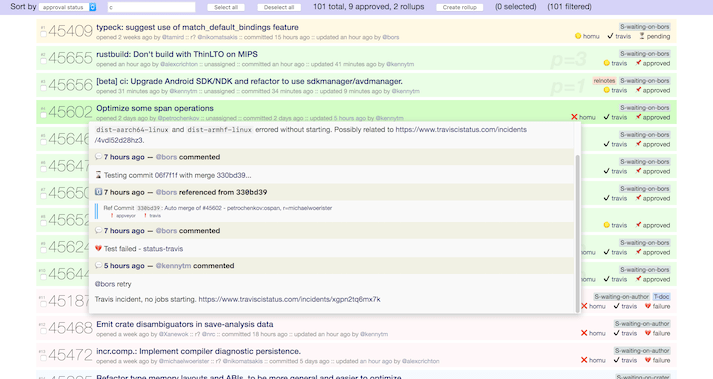

borsholder
==========

[](https://travis-ci.org/kennytm/borsholder)
[](https://crates.io/crates/borsholder)

**borsholder** is a dashboard for monitoring the [Rust compiler repository]'s pull requests status.
It is a combination of rust-lang/rust's [Homu queue] with useful information (labels, recent timeline,
CI status, etc) obtained from the GitHub API.



Installing
----------

1. Download [Rust].
2. Install **borsholder** by typing in the command line:

    ```sh
    cargo install borsholder
    ```

3. Register a GitHub account.
4. Create a [personal access token]. You do not need to enable any scopes or permissions.
5. Start **borsholder**:

    ```sh
    borsholder --token «your_personal_access_token»
    ```

6. Navigate to <http://127.0.0.1:55727> in your browser.

**Note:** The GitHub query is quite complex, and thus processing can be slow, and may take up to 2
minutes to get an output. If you see the webpage responds with
`Error: https://api.github.com/graphql: Server Error: 502 Bad Gateway`, please just wait for a while
and refresh.

Filter syntax
-------------

Enter any keyword in the filter text field to show a subset of the PRs. You may also look for a
specific field like below:

| Field                 | Example               |
|-----------------------|-----------------------|
| PR number             | `^number:45678`       |
| Author                | `^author:niko`        |
| Title                 | `^title:.*macro`      |
| Has merge conflict?   | `^conflict`           |
| Labels                | `^labels:.*-review`   |
| Is rollup?            | `^rollup`             |
| Priority              | `^p=[1-9]`            |
| Homu status           | `^approved`           |
| CI status             | `^travis:failure`     |

List of possible Homu status: Success, Pending, Approved, Reviewing, Error, Failure

List of possible CI status: Success, Pending, Error, Failure, Expected

[Rust]: https://rustup.rs/
[Rust compiler repository]: https://github.com/rust-lang/rust
[Homu queue]: https://buildbot2.rust-lang.org/homu/queue/rust
[personal access token]: https://help.github.com/articles/creating-a-personal-access-token-for-the-command-line/